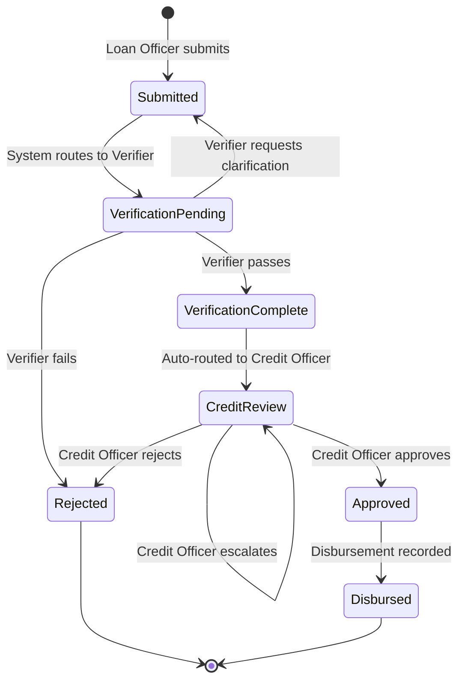

# Epic: Ampliify Frontend-Only Demo Users: Logout & Analytics 404 Issues

---

# Loan Processing Flow — User Guide

# Loan Processing Flow

<user_quoted_section>A plain-language walkthrough of how a loan application moves through LoanAP, from first contact with an applicant to final disbursement. Each section maps to a specific user role and the screens they interact with.</user_quoted_section>

## The Five Roles

| Role | What they do |
| --- | --- |
| **Loan Officer** | Captures and submits applications on behalf of applicants |
| **Verifier** | Conducts field verification of the applicant's details |
| **Credit Officer** | Reviews verified applications and makes approve/reject decisions |
| **Branch Manager** | Monitors the branch pipeline and SLA health |
| **Admin** | Manages users, branches, workflow config, and branding |

## End-to-End Flow

## Step-by-Step

### 1 — Loan Officer: Capture & Submit

The Loan Officer meets the applicant in the field or at the branch. They open the **New Application** screen and fill in:

- **Form type** — the loan product (pulled from ODK Central)
- **Applicant name** and **National ID**
- **Phone number** and **Loan amount**
- **Supporting documents** — ID scan, supporting paperwork (PDF/JPG/PNG)
- **Applicant photo**
- **GPS coordinates** — captured automatically from the device

The officer can **Save Draft** at any point to preserve progress without submitting. When ready, they click **Submit Application**. The application enters the system with status `Submitted` and is immediately routed to `VerificationPending`, triggering a notification to the assigned Verifier and Branch Manager.

### 2 — Verifier: Field Verification

The Verifier sees the new case appear in their **Verification Queue**. They open the case and work through a structured checklist:

- National ID verified
- Physical address confirmed
- Business premises visited
- Supporting documents reviewed
- Site photo captured

They add **site visit notes** and can upload photographic evidence directly from the detail screen. Once done, they choose one of three outcomes:

| Action | Result |
| --- | --- |
| **Passed** | Application moves to `VerificationComplete`, then immediately auto-advances to `CreditReview` |
| **Requires Clarification** | Application is sent back to `Submitted` for the Loan Officer to correct |
| **Failed** | Application is `Rejected` — Loan Officer and Branch Manager are notified |

<user_quoted_section>Note: The transition from VerificationComplete → CreditReview is automatic — the Verifier does not need to take a separate action.</user_quoted_section>

### 3 — Credit Officer: Review & Decision

The Credit Officer sees the application in their **Review Queue** with a summary of:

- Applicant details (name, ID, phone, loan amount, product type)
- Verification outcome and verifier notes
- Time the application has been in review (vs. the 24-hour SLA)

They write **Assessment Notes** (required before any action) and then choose:

| Action | Result |
| --- | --- |
| **Approve** | Application moves to `Approved` — Loan Officer and Branch Manager notified |
| **Reject** | Application moves to `Rejected` — Loan Officer and Branch Manager notified |
| **Escalate** | Application stays in `CreditReview` and is re-assigned to another Credit Officer |

### 4 — Branch Manager: Pipeline Oversight

The Branch Manager does not take actions on individual applications. Their **Dashboard** gives them a real-time view of:

- Total applications this month
- Counts by stage (Pending Verification, Pending Approval, Approved, Rejected)
- Approval rate and average processing time
- **Bottleneck Alerts** — applications that have exceeded their SLA at any stage, sorted by how overdue they are

SLA thresholds (configurable by Admin):

- `Submitted` → 4 hours
- `VerificationPending` → 48 hours
- `CreditReview` → 24 hours

### 5 — Disbursement

Once an application is `Approved`, disbursement is recorded by triggering the `disburse` action, moving the application to its final state: `Disbursed`. The Loan Officer and Branch Manager receive a notification.

## Notifications

Every major transition fires an in-app notification to the relevant parties:

| Event | Who is notified |
| --- | --- |
| Application submitted | Branch Manager, assigned Verifier |
| Verification passed | Credit Officers, Branch Manager |
| Routed to credit review | Assigned Credit Officer |
| Approved | Branch Manager, Loan Officer |
| Rejected / Failed | Branch Manager, Loan Officer |
| Disbursed | Branch Manager, Loan Officer |

## SLA & Audit

Every status change is recorded in a tamper-evident **Audit Log** with the actor, previous state, new state, timestamp, and any metadata (notes, checklist results). The Admin can view the full audit trail across all applications. Each `WorkflowState` record also stores the exact duration (in seconds) the application spent in that stage, enabling processing-time analytics.

## Demo Accounts

| Email | Password | Role |
| --- | --- | --- |
| `demo@loanap.local` | `demo` | Loan Officer |
| `verifier@loanap.local` | `demo` | Verifier |
| `credit@loanap.local` | `demo` | Credit Officer |
| `manager@loanap.local` | `demo` | Branch Manager |
| `admin@loanap.local` | `demo` | Admin |